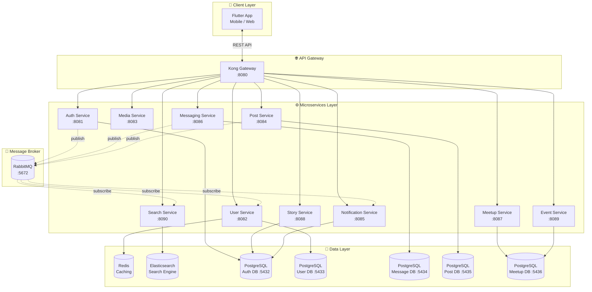
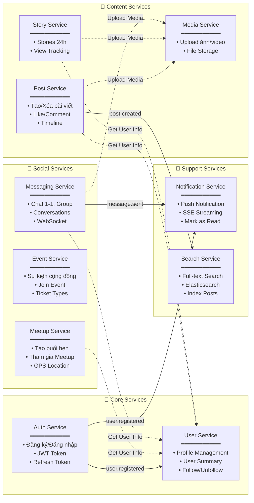
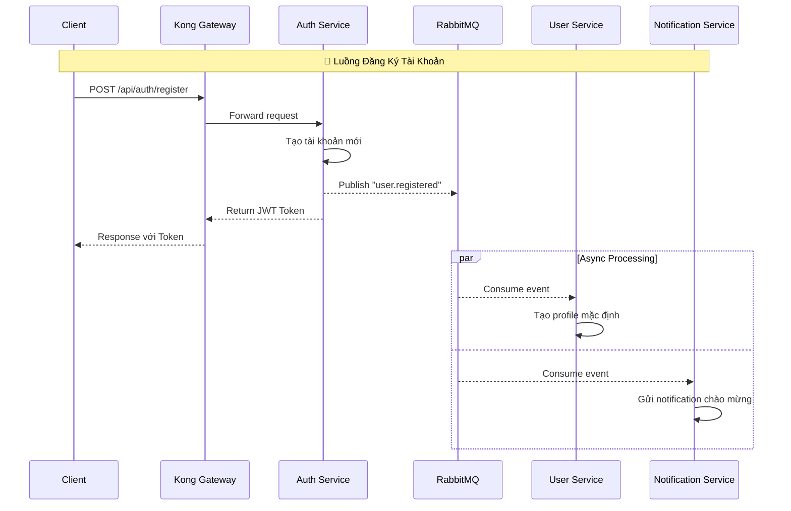
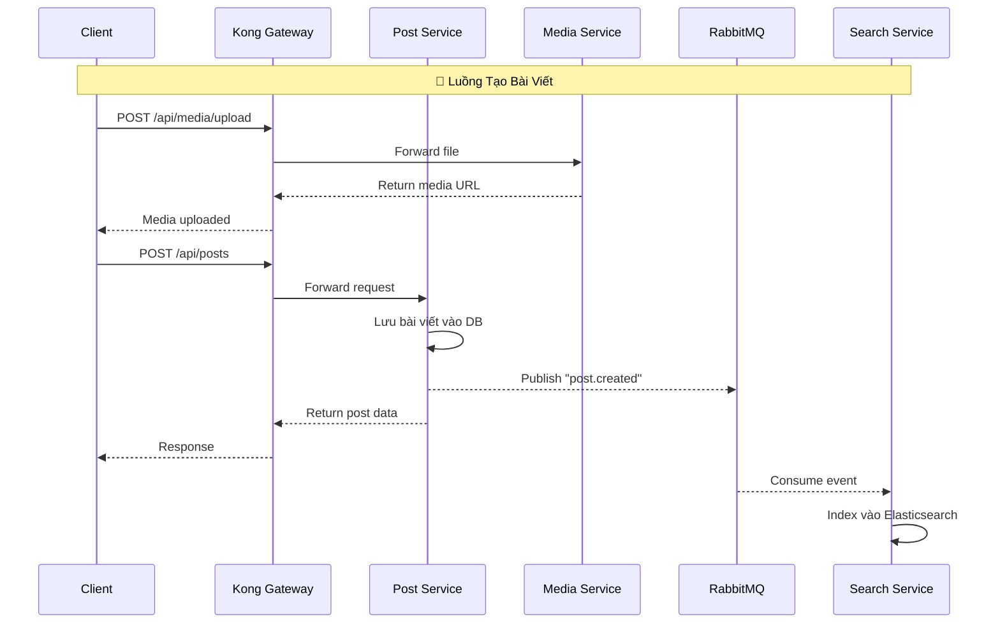

# 💖 FYN - Nền Tảng Hẹn Hò & Kết Nối Xã Hội

Dự án **FYN** là một ứng dụng mạng xã hội và hẹn hò hiện đại, được xây dựng với kiến trúc **Microservices (Java Spring Boot)** và **Multi-platform Frontend (Flutter)**. Hệ thống sử dụng Kong Gateway làm API Gateway và giao tiếp bất đồng bộ giữa các service thông qua RabbitMQ.

      

---

## 🏗️ Kiến Trúc Tổng Quan



---

## 🔗 Sơ Đồ Liên Kết Giữa Các Service

Biểu đồ dưới đây mô tả chi tiết **luồng dữ liệu và sự kiện** giữa các microservices:



---

## 📦 Chi Tiết Từng Service

### 🔐 Auth Service (Port: 8081)

**Chức năng:** Xác thực và phân quyền người dùng

| API Endpoint | Method | Mô tả |
|--------------|--------|-------|
| `/api/auth/login` | POST | Đăng nhập, trả về JWT Token |
| `/api/auth/register` | POST | Đăng ký tài khoản mới |

**Kết nối:**
- 📤 **Publish** event `user.registered` → RabbitMQ
- 📥 **Consumer:** User Service, Notification Service

---

### 👤 User Service (Port: 8082)

**Chức năng:** Quản lý thông tin người dùng và hồ sơ cá nhân

| API Endpoint | Method | Mô tả |
|--------------|--------|-------|
| `/api/users/{userId}/profile` | GET | Lấy thông tin profile |
| `/api/users/{userId}/profile` | PUT | Cập nhật profile |
| `/api/users/{userId}/summary` | GET | Lấy thông tin tóm tắt user |

**Kết nối:**
- 📥 **Subscribe** event `user.registered` từ Auth Service
- 🔄 **Caching:** Redis để cache user data
- 📍 Được gọi bởi: Post, Story, Meetup, Messaging Service

---

### 📷 Media Service (Port: 8083)

**Chức năng:** Quản lý upload và lưu trữ file media

| API Endpoint | Method | Mô tả |
|--------------|--------|-------|
| `/api/media/upload` | POST | Upload file (ảnh/video) |
| `/api/media/{id}` | GET | Lấy thông tin media |

**Kết nối:**
- 📍 Được gọi bởi: Post, Story, Messaging Service khi cần upload media

---

### 📝 Post Service (Port: 8084)

**Chức năng:** Quản lý bài viết và newsfeed

| API Endpoint | Method | Mô tả |
|--------------|--------|-------|
| `/api/posts` | POST | Tạo bài viết mới |
| `/api/posts` | GET | Lấy tất cả bài viết |
| `/api/posts/{id}` | GET | Lấy chi tiết bài viết |
| `/api/posts/author/{authorId}` | GET | Lấy bài viết theo tác giả |

**Kết nối:**
- 📤 **Publish** event `post.created` → RabbitMQ
- 📥 **Consumer:** Search Service (để index vào Elasticsearch)
- 🔗 **Gọi HTTP:** User Service, Media Service

---

### 🔔 Notification Service (Port: 8085)

**Chức năng:** Quản lý và gửi thông báo realtime

| API Endpoint | Method | Mô tả |
|--------------|--------|-------|
| `/api/notifications/stream/{userId}` | GET (SSE) | Stream thông báo realtime |
| `/api/notifications/user/{userId}` | GET | Lấy danh sách thông báo |
| `/api/notifications/{id}/read` | POST | Đánh dấu đã đọc |

**Kết nối:**
- 📥 **Subscribe** events từ Auth Service, Messaging Service
- 📡 **SSE Streaming** cho client

---

### 💬 Messaging Service (Port: 8086)

**Chức năng:** Nhắn tin realtime giữa users

| API Endpoint | Method | Mô tả |
|--------------|--------|-------|
| `/api/messages/conversations` | POST | Tạo cuộc hội thoại mới |
| `/api/messages/send` | POST | Gửi tin nhắn |
| `/api/messages/user/{userId}/conversations` | GET | Lấy danh sách hội thoại |
| `/api/messages/conversation/{id}` | GET | Lấy tin nhắn trong hội thoại |

**Kết nối:**
- 📤 **Publish** event `message.sent` → RabbitMQ
- 📥 **Consumer:** Notification Service
- 🔗 **Gọi HTTP:** User Service, Media Service

---

### ❤️ Meetup Service (Port: 8087)

**Chức năng:** Quản lý các buổi hẹn hò

| API Endpoint | Method | Mô tả |
|--------------|--------|-------|
| `/api/meetups` | POST | Tạo meetup mới |
| `/api/meetups` | GET | Lấy tất cả meetups |
| `/api/meetups/{id}` | GET | Chi tiết meetup |
| `/api/meetups/{id}/join` | POST | Tham gia meetup |

**Kết nối:**
- 🔗 **Gọi HTTP:** User Service để lấy thông tin người tạo/tham gia

---

### 📖 Story Service (Port: 8088)

**Chức năng:** Quản lý stories 24h

| API Endpoint | Method | Mô tả |
|--------------|--------|-------|
| `/api/stories` | POST | Tạo story mới |
| `/api/stories/user/{userId}` | GET | Lấy stories đang hoạt động |

**Kết nối:**
- 🔗 **Gọi HTTP:** User Service, Media Service

---

### 🎉 Event Service (Port: 8089)

**Chức năng:** Quản lý sự kiện cộng đồng

| API Endpoint | Method | Mô tả |
|--------------|--------|-------|
| `/api/events` | POST | Tạo sự kiện |
| `/api/events` | GET | Lấy tất cả sự kiện |
| `/api/events/{id}` | GET | Chi tiết sự kiện |
| `/api/events/{id}/join` | POST | Tham gia sự kiện (với loại vé) |

**Kết nối:**
- 📊 **Database:** Chia sẻ PostgreSQL Meetup DB (:5436)

---

### 🔍 Search Service (Port: 8090)

**Chức năng:** Tìm kiếm full-text với Elasticsearch

| API Endpoint | Method | Mô tả |
|--------------|--------|-------|
| `/api/search/posts` | GET | Tìm kiếm bài viết |

**Kết nối:**
- 📥 **Subscribe** event `post.created` từ Post Service
- 📊 **Index** dữ liệu vào Elasticsearch

---

## 🔄 Luồng Sự Kiện (Event Flow)





---

## 🛠️ Công Nghệ Sử Dụng

| Layer | Công nghệ |
|-------|-----------|
| **Backend** | Java 21, Spring Boot 3.4 |
| **API Gateway** | Kong 3.4 |
| **Message Broker** | RabbitMQ 3 |
| **Database** | PostgreSQL 15 (5 instances) |
| **Cache** | Redis Alpine |
| **Search** | Elasticsearch 8.11 |
| **Frontend** | Flutter 3 (Web, Android, iOS) |
| **Container** | Docker, Docker Compose |

---

## 🚀 Hướng Dẫn Cài Đặt

### Yêu Cầu
- Docker Desktop
- Java 21 SDK
- Maven 3.9+
- Flutter SDK 3.x

### 1️⃣ Khởi Chạy Infrastructure

```bash
docker-compose -f docker-compose.infra.yml up -d
```

Các services sẽ được khởi chạy:
| Service | URL |
|---------|-----|
| PostgreSQL Auth | `localhost:5432` |
| PostgreSQL User | `localhost:5433` |
| PostgreSQL Messages | `localhost:5434` |
| PostgreSQL Post | `localhost:5435` |
| PostgreSQL Meetup | `localhost:5436` |
| Redis | `localhost:6379` |
| RabbitMQ | `localhost:5672` |
| RabbitMQ UI | `http://localhost:15672` (guest/guest) |
| Elasticsearch | `http://localhost:9200` |
| Kong Gateway | `http://localhost:8080` |
| Kong Admin | `http://localhost:8001` |

### 2️⃣ Chạy Các Microservices

```bash
# Mở 10 terminal riêng hoặc chạy background
cd services/auth-service && mvn spring-boot:run -DskipTests &
cd services/user-service && mvn spring-boot:run -DskipTests &
cd services/media-service && mvn spring-boot:run -DskipTests &
cd services/post-service && mvn spring-boot:run -DskipTests &
cd services/notification-service && mvn spring-boot:run -DskipTests &
cd services/messaging-service && mvn spring-boot:run -DskipTests &
cd services/meetup-service && mvn spring-boot:run -DskipTests &
cd services/story-service && mvn spring-boot:run -DskipTests &
cd services/event-service && mvn spring-boot:run -DskipTests &
cd services/search-service && mvn spring-boot:run -DskipTests &
```

### 3️⃣ Chạy Flutter App

```bash
cd fyn-flutter-app
flutter pub get
flutter run
```

---

## 📁 Cấu Trúc Dự Án

```
fyn-microservice/
├── docker-compose.infra.yml    # Infrastructure containers
├── kong.yml                    # Kong Gateway config
├── fyn-common/                 # Shared libraries (DTOs, Utils)
├── fyn-flutter-app/            # Flutter frontend
└── services/
    ├── auth-service/           # Xác thực JWT
    ├── user-service/           # Quản lý user
    ├── media-service/          # Upload media
    ├── post-service/           # Bài viết
    ├── notification-service/   # Thông báo
    ├── messaging-service/      # Chat
    ├── meetup-service/         # Hẹn hò
    ├── story-service/          # Stories
    ├── event-service/          # Sự kiện
    └── search-service/         # Tìm kiếm
```

---

## 🔒 Tài Khoản Demo

| Role | Email | Password |
|------|-------|----------|
| Admin | `admin@fyn.vn` | `password` |
| User | `luan@gmail.com` | `password` |

---

Made with ❤️ by **FYN Team**
